# EPv2 Direct Dispatch 与 Combine

这份讲稿只围绕一个例子说明 direct 模式下 dispatch 和 combine 的数据流：notify 先统计规模，dispatch warp 分配 slot 并写到目标 rank，epilogue 整理输出，combine 再把 expert output 写回原 token。

## 1. 示例设置：4 ranks、8 experts、3 tokens

```text
4 ranks, 8 experts, topk = 2, experts/rank = 2

expert 0,1 -> rank 0
expert 2,3 -> rank 1
expert 4,5 -> rank 2
expert 6,7 -> rank 3
```

rank 0 的 gate 结果：

```text
token 0 -> experts [1,4] -> ranks [0,2]
token 1 -> experts [2,3] -> ranks [1,1]
token 2 -> experts [6,7] -> ranks [3,3]
```

实际 hidden data 转发：

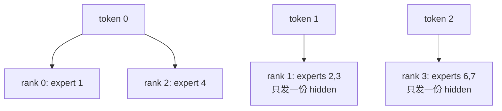

关键规则：

```text
rank 维度去重：同一个 token 发到同一个 rank，只占一个 recv slot。
expert 维度逐个记录：同一个 token 命中同 rank 的多个 expert，expert count 都分别计数。
```

## 2. 这个例子在 buffer 里怎么走

上面的例子说的是 token 要发到哪个 rank。真正写入时，这些 token 会落到 `ElasticBuffer` 管理的通信内存里。

`ElasticBuffer` 可以先理解成 dispatch/combine 共用的通信上下文：它持有 NCCL communicator 和一块跨 rank 可见的 symmetric window。这个 window 里主要分两类空间：

```text
workspace:     放计数、prefix sum、barrier 等控制信息。
data buffer:   放真正要搬运的 token payload。
```

dispatch kernel 启动后，会在这块 `data buffer` 上套用 direct dispatch 的 layout：目标 rank 用 `recv_buffer` 接收 token，非 NVLink 路径还会用 `send_buffer` 做临时暂存。

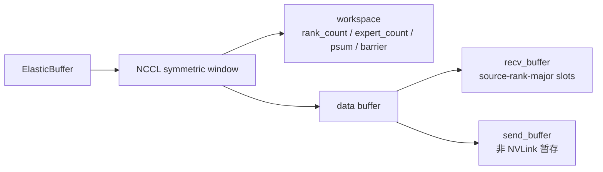

代码里的 direct dispatch layout 对应这两个对象：

```cpp
auto recv_buffer = layout::BufferLayout<false>(
    token_layout, kNumRanks, kNumMaxTokensPerRank, buffer);

auto send_buffer = layout::BufferLayout<false>(
    token_layout, 1, kNumMaxTokensPerRank, recv_buffer.get_buffer_end_ptr());
```

`recv_buffer` 的第一维是 source rank，第二维是该 source rank 发来的 slot：

```text
target rank recv_buffer

                 slot 0      slot 1      ...      slot N
source rank 0 | token     | token     | ... | token     |
source rank 1 | token     | token     | ... | token     |
source rank 2 | token     | token     | ... | token     |
source rank 3 | token     | token     | ... | token     |
```

每个 slot 存一份 token：

```text
| hidden | optional SF | topk_idx | topk_weights | src_metadata |
```

回到 rank 0 这 3 个 token，它们最终会写到各目标 rank 的 `recv_buffer[source rank 0][slot]`：

```text
rank 0 token 0 -> rank 0 recv_buffer[source rank 0][slot a]
rank 0 token 0 -> rank 2 recv_buffer[source rank 0][slot b]
rank 0 token 1 -> rank 1 recv_buffer[source rank 0][slot c]
rank 0 token 2 -> rank 3 recv_buffer[source rank 0][slot d]
```

所以 token 1 发到 rank 1，可以先理解为：


后面 notify 会决定“要发多少”，dispatch warp 会决定这里的 `assigned slot` 是几。NVLink 路径会用 symmetric pointer 定位目标 rank，再用 TMA store 写过去；非 NVLink / 跨机路径才会走 Gin / RDMA put。

## 3. notify 和 prefix sum：从发送数量到输出区间

dispatch 不是一上来就搬 token。它要先回答两个问题：

```text
1. rank 0 会给每个目标 rank 发多少个 token？
2. 每个目标 rank 收到所有 source rank 的 token 后，应该把它们排在 recv_x 的哪个区间？
```

第一步由 notify warps 扫 `topk_idx` 完成：

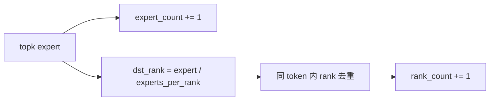

代码锚点：

```cpp
if (dst_expert_idx >= 0)
    atomicAdd_block(expert_count + dst_expert_idx, 1);

if (ptx::deduplicate(dst_rank_idx, lane_idx) and dst_rank_idx >= 0)
    atomicAdd_block(rank_count + dst_rank_idx, 1);
```

结合当前例子，rank 0 的 3 个 token 会得到：

```text
rank_count:
  rank 0: 1  # token 0
  rank 1: 1  # token 1，experts [2,3] 在同 rank，只算一个 slot
  rank 2: 1  # token 0
  rank 3: 1  # token 2，experts [6,7] 在同 rank，只算一个 slot

expert_count:
  expert 1: 1
  expert 2: 1
  expert 3: 1
  expert 4: 1
  expert 6: 1
  expert 7: 1
```

这两类 count 的作用不同：

```text
rank_count:   决定目标 rank 要收多少个 token，也就是 recv_buffer slot 和 recv_x 区间。
expert_count: 决定目标 rank 上每个本地 expert 会收到多少 token。
```

对 rank 1 来说，`rank_count = 1` 表示 rank 0 只会写 1 个 token slot；但 `expert_count` 里 expert 2 和 expert 3 都是 1，表示这个 token 后续会同时参与 rank 1 上两个 expert 的计算。普通 dispatch 主要用它返回每个 expert 的接收统计；expand dispatch 还会对 `expert_count` 做 prefix sum，决定按 expert 展开的输出位置。

然后 notify 把这些 count 写到各目标 rank 的 workspace。对 rank 1 来说，rank 0 会写入：“我会给你发 1 个 token，同时 expert 2 / expert 3 各收到 1 次命中”。

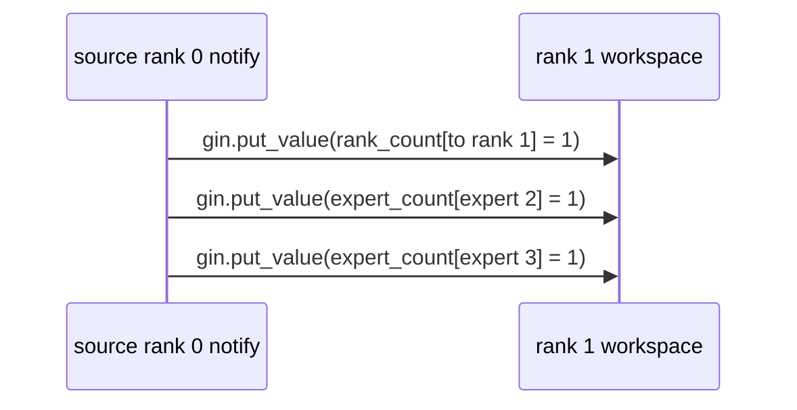

当 rank 1 收齐所有 source rank 写来的 count，就能做 prefix sum：

```cpp
do_psum(rank_count, psum_num_recv_tokens_per_scaleup_rank, kNumRanks, 0);
```

这里继续用 rank 1 举例。我们已经知道 `from rank0 = 1`，假设其他 source rank 也写来了这些 count：

```text
from rank0 = 1
from rank1 = 2
from rank2 = 0
from rank3 = 1
psum = [1, 3, 3, 4]
```

于是 rank 1 上的 compact 输出区间就是：

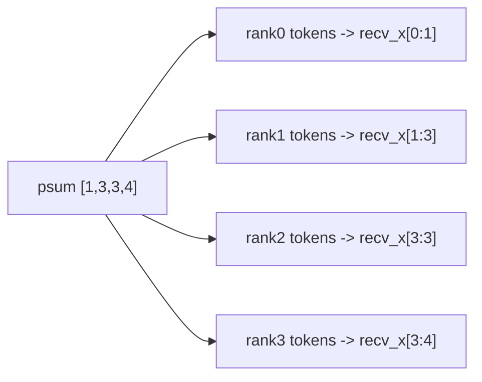

这一步把“每个 source rank 发多少”变成了“每个 source rank 在 `recv_x` 中的区间”。后面的 epilogue 就根据这个 psum，把 rank-major 的 `recv_buffer` 整理成连续 `recv_x`。

## 4. dispatch warp：分配 slot 并写到目标 rank

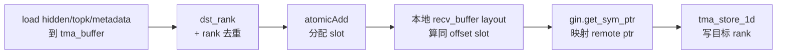

对 token 1：

```text
topk experts [2,3] -> dst ranks [1,1]
deduplicate 后只有一个 lane 对 sender_counter[1] 做 atomicAdd
如果 atomicAdd 返回 0，stored_dst_slot_idx = 0
它要写的位置就是 rank 1 recv_buffer[source rank 0][slot 0]
```

这里的 `atomicAdd` 只是在并发 dispatch warp 之间分配 slot。rank 0 可能同时有多个 token 要发到 rank 1，所以每个 token 都对 `sender_counter[1]` 抢一个不同的编号，避免写到同一个 `recv_buffer[source rank 0][slot]`。

拿到 `stored_dst_slot_idx` 后，代码仍然不是直接拼一个“rank 1 地址”。它先在当前 rank 的 `recv_buffer` layout 中定位同 offset 的本地 slot：

```text
local recv_buffer[source rank 0][slot 0]
```

然后再用 `gin.get_sym_ptr(local_ptr, dst_rank=1)` 把这个本地地址映射成 rank 1 symmetric window 里的 remote pointer，最后用 TMA store 写入。也就是说，layout 负责算“source rank 0 segment 里的第几个 slot”，symmetric pointer 负责把这个 offset 对到目标 rank，TMA 负责搬 payload。

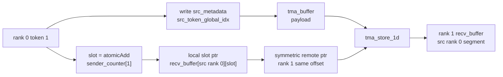

对应代码可以按三步看：

1) 先写 `src_metadata`（记录 source token identity，给 combine 回溯用）

```cpp
*tma_buffer.get_src_token_global_idx_ptr() =
    rank_idx * kNumMaxTokensPerRank + token_idx;
```

2) 再按目标 rank 分配 slot：

```cpp
if (ptx::deduplicate(stored_dst_rank_idx, lane_idx) and stored_dst_rank_idx >= 0)
    stored_dst_slot_idx =
        atomicAdd(workspace_layout.get_scaleup_atomic_sender_counter() + stored_dst_rank_idx, 1);
```

3) 最后用 layout 算本地 slot 指针，映射 remote pointer，并用 TMA 写目标 rank：

```cpp
// 先把 recv_buffer 定位到当前 source rank 的分段。
auto recv_buffer = layout::BufferLayout<false>(token_layout, kNumRanks, kNumMaxTokensPerRank, buffer);
recv_buffer = recv_buffer.get_rank_buffer(rank_idx);

// 再在这个 source-rank segment 中选 slot，并映射到目标 rank 的 symmetric window。
const auto dst_ptr = gin.get_sym_ptr<team_t>(
    recv_buffer.get_token_buffer(stored_dst_slot_idx).get_base_ptr(),
    stored_dst_rank_idx);

ptx::tma_store_1d(dst_ptr, tma_buffer.get_base_ptr(), tma_buffer.get_num_bytes<false>());
```

非 NVLink / RDMA direct 仍然是 direct dispatch，只是数据先写本地 `send_buffer`，再由 NCCL Gin / RDMA put 到目标 `recv_buffer`：

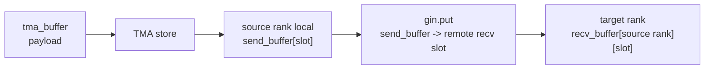

```text
direct = 没有 scale-out 转发
NVLink/RDMA = direct 模式里具体用哪种后端搬数据
```

## 5. epilogue：整理成用户输出

dispatch kernel 写完后，目标 rank 的 `recv_buffer` 还是 rank-major 的通信布局：

```text
recv_buffer[source rank 0][slot ...]
recv_buffer[source rank 1][slot ...]
recv_buffer[source rank 2][slot ...]
recv_buffer[source rank 3][slot ...]
```

以 rank 1 为例，前面 prefix sum 得到：

```text
from rank0 = 1
from rank1 = 2
from rank2 = 0
from rank3 = 1
psum = [1, 3, 3, 4]
```

这表示 rank 1 的最终输出 `recv_x` 这样排：

```text
rank0 发来的 token -> recv_x[0:1]
rank1 发来的 token -> recv_x[1:3]
rank2 发来的 token -> recv_x[3:3]
rank3 发来的 token -> recv_x[3:4]
```

所以当前例子里的 rank 0 token 1，dispatch 时先落在：

```text
rank 1 recv_buffer[source rank 0][slot 0]
```

epilogue 再根据 psum 把它拷到 rank 1 的：

```text
recv_x[0]
```

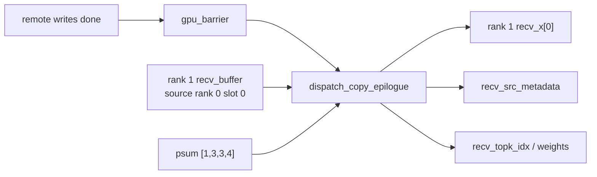

这里的同步点可以简化成三步：

```text
1) dispatch 末尾先做 tma_store_commit / tma_store_wait，确保本 rank 发出的写请求已经落地。
2) 然后做 gpu_barrier（NVLink 用对端 signal 原子加，非 NVLink 用 Gin signal），确认所有 rank 都写完。
3) dispatch_copy_epilogue 开头用 cudaGridDependencySynchronize，保证读取 recv_buffer 时数据已可见。
```

结合当前例子，rank 0 的 token 1 已经通过 TMA 写到：

```text
rank 1 recv_buffer[source rank 0][slot 0]
```

但 rank 1 不能马上让 epilogue 读取它，因为其他 source rank 也可能还在写 rank 1 的其他 segment，例如：

```text
rank 1 recv_buffer[source rank 1][slot ...]
rank 1 recv_buffer[source rank 3][slot ...]
```

所以所有 rank 的 dispatch kernel 都要先到 `gpu_barrier`。在 NVLink direct 场景里，每个 rank 会通过 symmetric pointer 更新对端 workspace 里的 barrier signal；rank 1 只有看到所有 rank 都到达这个 barrier，才认为自己的 `recv_buffer` 已经完整可读。之后本 rank 的 `dispatch_copy_epilogue` 才会根据 `psum [1,3,3,4]` 去读 `source rank 0 slot 0`，并把 token 1 放到 `recv_x[0]`。

```text
dispatch_impl 负责跨 rank 写通信 buffer；
dispatch_copy_epilogue 负责把通信 buffer 整理成用户看到的连续 tensor。
```

## 6. combine：把 expert output 写回原 token

combine 可以看成 dispatch 的反向过程。dispatch 后，rank 1 上的 MoE expert 会处理：

```text
rank 1 recv_x[0]  # 来自 rank 0 token 1
```

expert 算完后，combine 要把这个 output 送回 rank 0 的原 token 1。对这个例子，rank 1 的 combine main kernel 会做：

```text
读取 rank 1 recv_x[0] 的 expert output
根据 metadata 知道它属于 rank 0 token 1
写回 rank 0 的 combine recv/reduce buffer[rank 1][token 1]
```

这个过程依赖 epilogue 产出的 `recv_src_metadata`：

```text
recv_src_metadata[0]:
  src_token_idx = 1
  src_rank_idx = 0
  src_topk_idx = 0  # master top-k lane
```

代码里 combine kernel 会从 metadata 还原这些信息：

```cpp
constexpr int kMetadataStride = 2 + kNumTopk;
const int src_token_idx = __ldg(src_metadata + i * kMetadataStride) % kNumMaxTokensPerRank;
const int src_rank_topk_idx = __ldg(src_metadata + i * kMetadataStride + 1);
const int src_rank_idx = src_rank_topk_idx / kNumTopk;
const int src_topk_idx = src_rank_topk_idx % kNumTopk;
```

这里的 `src_topk_idx = 0` 不是说 expert 3 的 top-k lane 也是 0。token 1 原始 top-k 是：

```text
top-k lane 0 -> expert 2 -> rank 1
top-k lane 1 -> expert 3 -> rank 1
```

但是 dispatch 对 rank 去重后，rank 1 只收到一份 hidden，对应一条 `recv_src_metadata`。这条 metadata 需要选一个 lane 代表这次“发到 rank 1”，代码选第一个命中的 lane，所以 `src_topk_idx = 0`。expert 3 的 lane 1 仍然保存在 `recv_topk_idx / recv_topk_weights` 里，后续本地 MoE 会一起处理；`src_topk_idx` 只是 master lane，不是所有 expert 的 top-k idx。

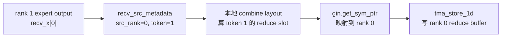

这里和 dispatch 一样，也不是直接拼 rank 0 地址。对 token 1，rank 1 先用本地 combine layout 算同 offset slot：

```text
local combine recv_buffer[rank 1][token 1]
```

再用 `gin.get_sym_ptr(local_ptr, src_rank_idx=0)` 映射成 rank 0 symmetric window 里的：

```text
rank 0 combine recv/reduce buffer[rank 1][token 1]
```

```cpp
auto token_buffer = recv_buffer
    .get_rank_buffer(rank_idx)
    .get_token_buffer(src_token_idx);
token_buffer.set_base_ptr(gin.get_sym_ptr<team_t>(token_buffer.get_base_ptr(), src_rank_idx));

ptx::tma_store_1d(master_token_buffer.get_base_ptr(), tma_buffer.get_base_ptr(), kNumHiddenBytes);
```

这里要区分两种 reduce。token 1 的两个 expert 都在 rank 1，本地 MoE 计算阶段会把 expert 2/3 的结果按 top-k weight 合成一份 rank 1 partial output：

```text
expert 2 output + expert 3 output -> rank 1 partial output
```

这个是 MoE 计算层面的本地合并，发生在调用 `combine()` 之前。到了 DeepEP combine main kernel，输入 `x[i]` 已经是这份 per-rank partial output，所以 normal direct combine 通常不再做 kernel 内 local reduce。代码里 `not kUseExpandedLayout` 会走 `no_local_reduce` 分支：它只把当前 rank 已经算好的 partial output 搬回 original rank 的 reduce buffer。

```cpp
auto no_local_reduce = not kUseExpandedLayout or
    (kAllowMultipleReduction and __popc(reduce_valid_mask) == 1);
if (no_local_reduce) {
    ptx::tma_store_1d(master_token_buffer.get_base_ptr(), tma_buffer.get_base_ptr(), kNumHiddenBytes);
}
```

真正把多个 partial output 归并成 `combined_x` 的，是后面的 `combine_reduce_epilogue`。它会重新看原始 `combined_topk_idx`，算出每个 top-k expert 属于哪个 rank，然后按 rank 去重：

```text
token 1 topk experts [2,3] -> dst ranks [1,1]
按 rank 去重后，只需要读取 reduce buffer[rank 1][token 1] 一次
```

所以对 token 1 来说，reduce epilogue 的 reduce 是“单输入 reduce”：两个 top-k 都来自 rank 1，rank 1 写回的那份 partial output 已经代表这个 rank 对 token 1 的结果。

如果一个 token 的 top-k 分布在多个 rank，例如：

```text
token 0 topk experts [1,4] -> dst ranks [0,2]
```

那么 reduce epilogue 会读取：

```text
reduce buffer[rank 0][token 0]
reduce buffer[rank 2][token 0]
```

然后用 `combine_reduce` 把它们相加，写成 `combined_x[token 0]`。这就是 combine 的最终 reduce。

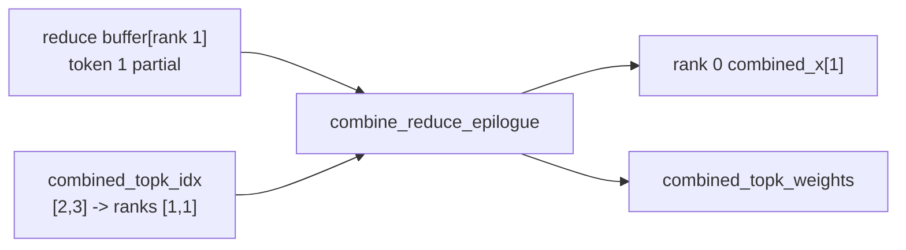

对应到例子：

```text
dispatch: rank 0 token 1 -> rank 1 recv_x[0]
expert:   rank 1 recv_x[0] -> expert output
combine:  expert output -> rank 0 reduce buffer[rank 1][token 1]
epilogue: reduce buffer[rank 1][token 1] -> rank 0 combined_x[1]
```

## 7. direct + 同 NVLink 域：dispatch/combine 对 NCCL 接口的依赖

这个场景下（`num_scaleout_ranks == 1` 且 peer 在同一 NVLink 域），核心依赖是 NCCL 的 device communicator + symmetric window，而不是 RDMA put。

```text
核心对象:
- ncclDevComm_t: device 侧通信上下文（team 信息、Gin 上下文）
- ncclWindow_t:  symmetric memory window（跨 rank 同 offset 可映射）
- NCCLGin:       DeepEP 在 kernel 内对 ncclGin 的封装
```

dispatch 里主要用到：

```text
1) get_sym_ptr<ncclTeamTagLsa>(local_ptr, dst_rank)
   - 基于 ncclWindow + offset，把本地 slot 指针映射成目标 rank 的同 offset 指针。
2) ptx::tma_store_1d(remote_ptr, tma_buffer)
   - 真正把 token payload 写到目标 rank recv_buffer。
3) gpu_barrier（NVLink 分支）
   - 用 symmetric pointer 指向对端 workspace signal，再做原子加/等待，保证所有 rank 写入完成可见。
```

combine 里主要用到：

```text
1) get_sym_ptr<ncclTeamTagLsa>(local_reduce_slot_ptr, src_rank)
   - 把当前 rank 的本地 reduce slot 映射到 original rank。
2) ptx::tma_store_1d(remote_ptr, tma_buffer)
   - 把本 rank partial output 写回 original rank 的 reduce buffer。
```

总结
```text
代码层：有些路径会调用 gin.put / gin.putValue 这个统一封装接口。
执行层：在同 NVLink 域可达时，封装内部先 get_sym_ptr，实际走的是 symmetric pointer 直写（TMA/store）；只有拿不到对称指针时才退化到 Gin put/putValue。
```

## 8. 当前两个优化：dispatch no-copy 和 combine pipeline

### dispatch no-copy

普通 dispatch 会先把 token 写到通信用的 `recv_buffer`，然后 `dispatch_copy_epilogue` 再把 rank-major 的 `recv_buffer` 整理成最终输出：

```text
dispatch_impl -> recv_buffer -> dispatch_copy_epilogue -> recv_x / topk / weights / metadata
```

no-copy 优化的目标是跳过这次 epilogue copy。direct NVLink、BF16 normal dispatch 场景下，notify 阶段已经知道每个 source rank 在 compact `recv_x` 里的 base offset，于是 dispatch warp 可以直接算出最终输出位置：

```text
compact_recv_x_idx = recv_x_base_offset[dst_rank] + stored_dst_slot_idx
```

然后 dispatch kernel 直接写最终输出区：

```text
hidden        -> final recv_x[compact_recv_x_idx]
topk_idx      -> final recv_topk_idx[compact_recv_x_idx]
topk_weights  -> final recv_topk_weights[compact_recv_x_idx]
src_metadata  -> final recv_src_metadata[compact_recv_x_idx]
```

这样可以减少甚至跳过普通路径中的 `dispatch_copy_epilogue` 搬运成本；实际收益主要看 `dispatch_impl` 直写最终输出后，剩余同步和 metadata 整理开销有多少。

下面是 BF16 normal dispatch 的实测对比，数据取每组日志中 4 个可见 rank 的平均值。这里看有效 SU 带宽，比 latency 更能反映 no-copy 对大数据搬运的收益：

```text
EP4:  数据量约 473 MB
      API 带宽:    679 GB/s -> 722 GB/s，提升约 6.3%
      kernel 带宽: 679 GB/s -> 752 GB/s，提升约 10.8%

EP8:  数据量约 945 MB
      API 带宽:    533 GB/s -> 602 GB/s，提升约 12.9%
      kernel 带宽: 533 GB/s -> 618 GB/s，提升约 15.9%

EP16: 数据量约 945 MB
      API 带宽:    532 GB/s -> 604 GB/s，提升约 13.5%
      kernel 带宽: 532 GB/s -> 624 GB/s，提升约 17.3%
```

结论是：数据量从 EP4 的约 473 MB 增加到 EP8/EP16 的约 945 MB 后，no-copy 的带宽收益更明显。EP4 的 API 带宽提升约 6%，而 EP8/EP16 提升到约 13%；kernel 侧提升也从约 11% 增加到约 16%～17%。这符合预期：数据越大，跳过中间 `recv_buffer -> final output` 搬运带来的收益越容易摊薄同步和固定开销。

### combine pipeline

普通 combine 是两段式：

```text
combine_impl 写回 reduce buffer
combine_reduce_epilogue 再读取 reduce buffer，做最终 reduce 并写 combined_x
```

pipeline 优化把 hidden 维度切成多个 chunk，让 main combine 和 reduce epilogue 按 chunk 重叠：

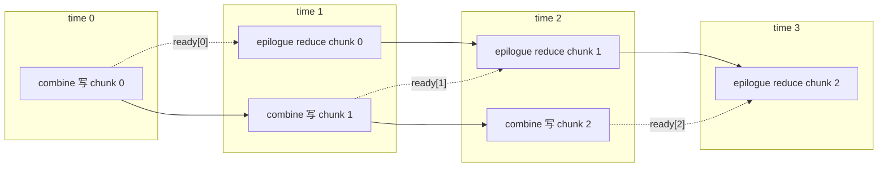

实现上，PDL 只负责让 epilogue 提前启动，并在 `cudaGridDependencySynchronize()` 处等 producer 到达安全点。每个 chunk 真正什么时候能读，由独立的 ready flag 控制：

```text
combine 写完 chunk k -> gpu_barrier -> combine_chunk_ready[k] = 1
epilogue 等到 ready[k] -> reduce/copy chunk k
```

这样可以把“combine 写回通信 buffer”和“reduce epilogue 读 buffer 做最终输出”部分重叠起来，降低串行等待。当前约束是 hidden size 必须能按 chunk 对齐切分，并且 `num_hidden_chunks > 1` 的 pipeline 路径目前限制在单 scale-out 的 scale-up combine 场景。
