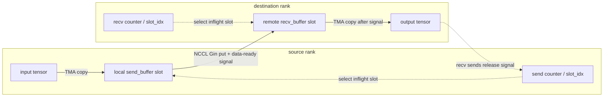
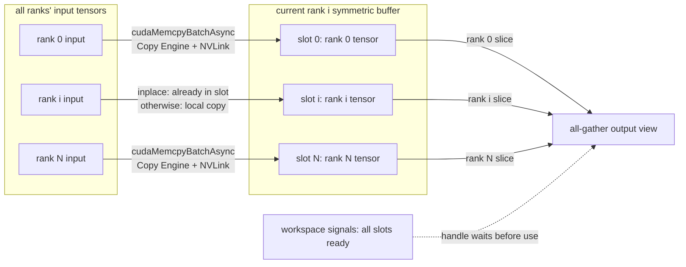

# EPv2 PP Send/Recv 与 AGRS all-gather 实现调研

本文梳理 EPv2 中 PP send/recv 和 AGRS all-gather 相关实现，重点关注它们是否真的属于 “0 SM” 路径。

## 结论

- PP send/recv 当前代码路径会启动 `pp_send_impl` / `pp_recv_impl` JIT kernel；数据搬运主要依赖 TMA 和 NCCL Gin put，底层走 NVLink 还是 RDMA 由 NCCL 根据目标 rank 拓扑决定。
- AGRS all-gather 对应 `ElasticBuffer.all_gather` 路径，不走自定义 CUDA kernel，主要使用 `cudaMemcpyBatchAsync` 和 CUDA stream memory operations，更符合 “0 SM with Copy Engine” 的描述。
- 两者都复用 `ElasticBuffer` 的 NCCL symmetric memory window 和 workspace signals。

## PP Send/Recv

Python 接口在 `ElasticBuffer` 上：

```python
buffer.pp_set_config(num_max_tensor_bytes, num_max_inflight_tensors)
buffer.pp_send(t, dst_rank_idx)
buffer.pp_recv(t, src_rank_idx)
```

`pp_set_config` 会记录：

- `prev_rank_idx` / `next_rank_idx`
- `num_max_pp_tensor_bytes`
- `num_max_pp_inflight_tensors`

其中：

- `num_max_pp_tensor_bytes`：单次 `pp_send` / `pp_recv` 允许处理的最大 tensor 字节数。实际传入的 tensor 必须连续，并且 `x.nbytes() <= num_max_pp_tensor_bytes`。
- `num_max_pp_inflight_tensors`：每个方向最多允许占用但尚未释放的 tensor slot 数，也就是每个方向预留多少个 ring-buffer slot。send/recv 会用 counter 对它取模来选择当前 slot；只有对端消费后发回 release signal，该 slot 才能再次用于新的发送。

PP 的 ring 不是额外建立的通信拓扑，而是在 `pp_set_config` 中由当前 rank 和 `num_ranks` 直接计算出来：

```text
prev_rank_idx = (rank_idx + num_ranks - 1) % num_ranks
next_rank_idx = (rank_idx + 1) % num_ranks
```

因此 `pp_send` / `pp_recv` 只允许和这两个相邻 rank 通信：

```text
dst_rank_idx == prev_rank_idx or next_rank_idx
src_rank_idx == prev_rank_idx or next_rank_idx
```

也就是说，当前 PP API 不是任意 rank 间的 point-to-point，而是固定支持 `prev` / `next` 两个方向。底层 buffer 也只为这两个方向预留 send/recv 区域。

### Buffer Layout

PP buffer 按方向和 inflight slot 划分。每个 rank 维护面向前后两个邻居的 send/recv 区域：

```text
recv from one neighbor
recv from the other neighbor
send to one neighbor
send to the other neighbor
```

每个区域有 `num_max_inflight_tensors` 个 slot，每个 slot 大小为 `num_max_pp_tensor_bytes`。

总 buffer size 由 `get_pp_buffer_size_hint` 给出：

```text
align(num_max_tensor_bytes, 32) * num_max_inflight_tensors * 2 * 2
```

其中两个 `2` 分别表示 send/recv 和 prev/next 两个方向。

### Send Path

`pp_send_impl` 的流程：

1. 根据 `rank_idx` 和 `dst_rank_idx` 判断使用哪个方向的 buffer。
2. 根据 send counter 选择 inflight slot。
3. 等待该 slot 被对端释放，避免覆盖未消费数据。
4. 使用 TMA 把用户 tensor 复制到本地 `send_buffer`。
5. 等待 TMA copy 完成后，通过 NCCL Gin put 把本地 `send_buffer` 写到目标 rank 的 `recv_buffer`。
6. Gin put 携带 signal，通知对端 recv buffer 已经可读。

整体数据路径可以概括为：

```text
用户 tensor --TMA--> 本地 send_buffer --gin.put / NVLink 或 RDMA--> 远端 recv_buffer
```

其中第 4 步的关键代码是：

```cpp
const auto slot_idx = send_count % num_max_inflight_tensors;
auto send_buffer_ptr = math::advance_ptr(
    buffer, ((dst_idx_in_local + 2) * num_max_inflight_tensors + slot_idx) * num_max_tensor_bytes);

tma_copy<kNumSMs, kNumSmemBytes>(x, send_buffer_ptr, num_x_bytes, sm_idx);
```

这里的 `kNumSMs` 来自 PP kernel launch 的 `num_sms`，也就是本次 copy 启动的 block 数；代码里用 `blockIdx.x` 作为 `sm_idx`，按它把 tensor 切成多段并行搬运。`kNumSmemBytes` 是每个 block 可用的 shared memory 大小，用来决定 TMA staging buffer 每个 pipeline stage 能放多少字节。`tma_copy` 内部会用多个 stage 做 TMA load/store pipeline；

随后同步所有 block，并发起 `gin.put`：

```cpp
// Wait until all SMs finish TMA copy into the local send_buffer.
cooperative_groups::this_grid().sync();

gin.put<ncclTeamTagWorld>(
    recv_buffer_ptr, send_buffer_ptr,
    num_x_bytes, dst_rank_idx, 0,
    ncclGin_SignalInc(static_cast<ncclGinSignal_t>(local_idx_in_dst + kNumRanks)));
```

### Recv Path

`pp_recv_impl` 的流程：

1. 根据 `src_rank_idx` 判断从哪个方向的 recv buffer 读取。
2. 根据 recv counter 选择 inflight slot。
3. 等待对端 send 写入 signal。
4. 使用 TMA 把 `recv_buffer` 复制到用户输出 tensor。
5. 发送释放 signal 给 source rank，表示该 slot 可以复用。

整体数据路径可以概括为：

```text
本地 recv_buffer --TMA--> 用户输出 tensor --release signal--> source rank
```

### 数据输出流程



### 关于 0 SM

从当前代码看，PP send/recv 并不是完全没有 kernel 参与：

- `pp_send_impl` / `pp_recv_impl` 都是 JIT 生成的 CUDA kernel。
- launch 参数中使用 `num_sms` 个 block，每个 block 32 threads。
- Python API 中 `num_sms=0` 表示使用设备全部 SM，而不是 0 个 SM。

因此更准确的理解是：PP 的大块数据搬运主要依赖 TMA 和 NCCL Gin put，SM 侧主要承担控制、同步、TMA 提交和 Gin put 提交；但当前实现不能简单理解为完全不占用 SM。

## AGRS all-gather

本文中的 AGRS all-gather 指当前 `ElasticBuffer.all_gather` 路径。Python 接口为：

```python
buffer.agrs_set_config(num_max_session_bytes, num_max_all_gathers_per_session)
with buffer.agrs_new_session():
    out, handle = buffer.all_gather(t)
    handle()
```

AGRS 当前要求所有 rank 在同一个 NVLink domain：

```text
num_nvl_ranks == num_ranks
```

因此它主要是 scale-up / NVLink 域内 all-gather，而不是跨 RDMA 的 all-gather。

### Buffer Layout

每个 all-gather tensor 在 buffer 中按 rank 连续放置：

```text
rank 0 tensor | rank 1 tensor | ... | rank N tensor
```

如果使用 `agrs_get_inplace_tensor`，当前 rank 的输入 tensor 直接位于自己的 rank slot 中，避免再 copy 一次。

### All-Gather Path

`ElasticBuffer.all_gather` 的流程：

1. 为每个 tensor 在 session buffer 中分配 offset。
2. 为每个目标 rank 构造一组 `src_ptr -> dst_ptr` 拷贝任务。
3. 调用 `cudaMemcpyBatchAsync` 批量执行跨 rank symmetric memory copy。
4. 使用 `cuda_driver::batched_write_and_wait` 写入并等待 workspace signal。
5. 返回 view 到 buffer 的输出 tensor，以及一个等待 handle。

第 5 步返回的 output tensor 不是新分配并拷贝出的独立结果，而是通过 `torch::from_blob(buffer + offset)` 创建的 view，直接指向 `ElasticBuffer` 内部的 AGRS session buffer。模型如果只在当前 session 内消费它，可以直接用；如果需要在 session 结束、buffer 复用后继续保留结果，就需要调用方自己 `clone()` 或 copy 到其他 tensor。

第 3 步可以理解为：

```text
cudaMemcpyBatchAsync -> Copy Engine -> NVLink P2P copy
```

`cudaMemcpyBatchAsync` 只是把一批 memcpy 提交到 CUDA stream；真正搬运数据的是 GPU Copy Engine。目标地址指向 NCCL symmetric memory window 中其他 rank 的 buffer，所以在 NVLink 域内，这些 P2P copy 会通过 NVLink 完成，不需要启动自定义 CUDA kernel。

### 数据输出流程



核心数据搬运不是自定义 CUDA kernel，而是：

```cpp
// 设置 batch memcpy 的访问属性，尽量和 compute 重叠。
cudaMemcpyAttributes attrs = {
    .srcAccessOrder = cudaMemcpySrcAccessOrderStream,
    .flags = cudaMemcpyFlagPreferOverlapWithCompute
};

// 把一批 src -> dst copy 提交到 comm_stream，实际搬运由 Copy Engine 执行。
cudaMemcpyBatchAsync(
    dst_ptrs.data(), src_ptrs.data(), sizes.data(),
    num_copies, attrs, comm_stream);
```

`cudaMemcpyBatchAsync` 本身只是异步提交，host 不会在这里等待完成。完成顺序由 CUDA stream 保证：后面的 signal write / wait 也提交到同一个 `comm_stream`，因此只有前面的 batch memcpy 完成后，stream 才会继续执行这些 signal 操作。

同步使用 CUDA driver stream memory operations：

```cpp
// 向其他 rank 的 workspace 写入本 rank 已完成 copy 的 signal。
for (int i = 0; i < write_ptrs.size(); ++ i)
    ops[i] = create_mem_op(write_ptrs[i], value, CU_STREAM_MEM_OP_WRITE_VALUE_32);

// 等待其他 rank 写到本 rank workspace 的 signal。
for (int i = 0; i < wait_ptrs.size(); ++ i)
    ops[write_ptrs.size() + i] = create_mem_op(
        wait_ptrs[i], value, CU_STREAM_MEM_OP_WAIT_VALUE_32, CU_STREAM_WAIT_VALUE_GEQ);

// 在同一个 CUDA stream 上批量提交 write + wait 操作。
cuStreamBatchMemOp(stream, ops.size(), ops.data(), 0);
```

### 关于 0 SM

AGRS all-gather 路径更符合 “0 SM with Copy Engine”：

- 没有为 all-gather 启动自定义 CUDA data movement kernel。
- 数据搬运由 `cudaMemcpyBatchAsync` 提交给 CUDA runtime/Copy Engine。
- 同步由 stream memory operations 完成。
- compute stream 通过返回的 handle 等待 comm stream 上的事件。

因此它比 PP send/recv 更接近真正意义上的 0 SM 通信路径。

### 与 CUDA Graph 的关系

AGRS all-gather 当前不适合直接放进可重复 replay 的 CUDA Graph 中，主要原因是它依赖 host 侧状态和 workspace signal：

- `all_gather` 会在 host 侧递增 `agrs_buffer_offset` / `agrs_buffer_slot_idx`。
- signal 等待值来自 `agrs_session_idx`，capture 后会固定在 graph 里。
- CUDA Graph replay 只重放 GPU work，不会重新执行这些 host 侧状态更新。

因此，replay 时可能复用 capture 时的 slot 和 signal value，导致 wait 直接通过，不能保证本轮 all-gather 数据已经到齐。按当前实现，建议把 AGRS all-gather 放在 CUDA Graph 外使用。

## 对比小结

PP send/recv 的数据路径是 TMA + NCCL Gin put，有 `pp_send_impl` / `pp_recv_impl` 自定义 kernel 参与控制，通信范围限制在 ring 相邻 rank。

AGRS all-gather 的数据路径是 `cudaMemcpyBatchAsync`，没有 all-gather data movement kernel，主要依赖 workspace signal 和 stream memory operations，同步范围当前限制在单 NVLink domain。

因此，从当前代码看，AGRS all-gather 更接近 0 SM / Copy Engine；PP send/recv 更像是用 SM 做轻量控制，用 TMA 和 NCCL Gin put 做主要 payload 搬运。

