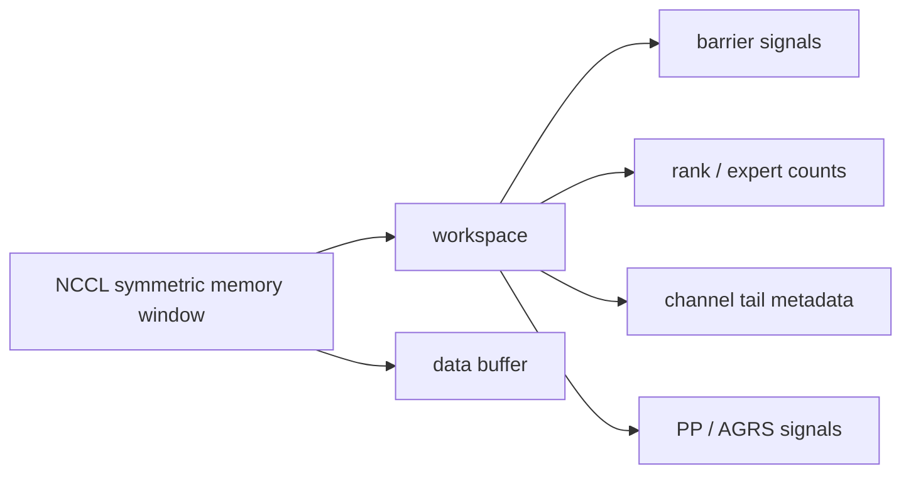

# EPv2 原理

## ElasticBuffer

`ElasticBuffer` 是 EPv2 的核心通信上下文。它对外提供 dispatch/combine 等通信接口；在内部，它不只是一块 symmetric memory，还包含围绕这块内存建立起来的一组通信资源：

- PyTorch `ProcessGroup` 中的 rank 信息。
- NCCL communicator：描述参与 EP 通信的 rank 集合和通信域，是 EPv2 建立 NCCL device communicator、查询拓扑、注册 symmetric memory window 的基础。
- NCCL device communicator：由 `ncclDevCommCreate` 创建，传给 GPU kernel，使 kernel 可以在 GPU 侧通过 NCCL Gin 发起通信；跨机 / 跨 RDMA domain 的数据搬运主要依赖它提供的 Gin 通信能力。
- NCCL symmetric memory window：通过 `ncclMemAlloc` / `ncclCommWindowRegister` 注册的一段跨 rank 可见 GPU 内存，EPv2 的 workspace 和 data buffer 都放在这里。
- EPv2 的 workspace 和 data buffer。
- scale-out / scale-up 拓扑信息。
- 通信 stream 和异步事件。

这些不是 `ElasticBuffer` 对外暴露的功能，而是它初始化后保存的内部状态和后端资源。真正的用户功能是 dispatch/combine；这些资源用于支撑后续 EPv2 kernel 执行。

## 基于 NCCL 建立 ElasticBuffer

创建 `ElasticBuffer` 时，Python 层首先从 `ProcessGroup` 获取 rank 信息，并通过 `get_nccl_comm_handle(group)` 得到 NCCL communicator：

```python
self.rank_idx = group.rank()
self.num_ranks = group.size()
self.nccl_comm_handle = get_nccl_comm_handle(group)
```

拿到 NCCL communicator 后，Python 层会用它计算 buffer 大小，并创建 C++ 侧 runtime：

```python
num_bytes = _C.calculate_elastic_buffer_size(...)
self.runtime = _C.ElasticBuffer(..., self.nccl_comm_handle.get(), num_bytes, ...)
```

这里的 `num_bytes` 是后面 `data buffer` 的大小，不包含 `workspace`。C++ 构造 symmetric memory window 时会再加上 `WorkspaceLayout::get_num_bytes()`：

```text
symmetric window size = workspace bytes + num_bytes
```

`calculate_elastic_buffer_size` 的计算逻辑可以概括为：

1. 根据 NCCL communicator 和 `allow_hybrid_mode` 推导 logical topology：`num_scaleout_ranks` / `num_scaleup_ranks`，并判断 scale-up 域是否是 NVLink。
2. 按 `hidden`、`num_topk`、是否 FP8 dispatch 计算一个 token slot 的大小。
3. 分别估算 dispatch 和 combine 两种 layout 的 data buffer 需求：
   - dispatch：主要计算接收 token 的 `recv_buffer`，以及非纯 NVLink 路径下用于跨 scale-out / RDMA 转发的 `send_buffer`。
   - combine：主要计算接收并归并 expert output 的 `recv/reduce buffer`，以及非纯 NVLink 路径下把结果发回 original rank 的 `send_buffer`。
4. 返回二者较大值：

```text
num_bytes = max(dispatch_buffer_bytes, combine_buffer_bytes)
```

C++ `ElasticBuffer` 随后创建 `NCCLSymmetricMemoryContext`，其中最核心的是通过 `ncclMemAlloc` 和 `ncclCommWindowRegister` 注册一段 NCCL symmetric memory window。

注册的 window 会被拆成两部分：

```text
workspace | data buffer
```

`workspace` 保存计数、barrier 和同步元数据；`data buffer` 用于 dispatch/combine 的 token 数据搬运。至此，`ElasticBuffer` 就完成了 NCCL 后端初始化，后续 EPv2 kernel 可以直接复用 `dev_comm`、`window`、`workspace` 和 `buffer` 完成跨 rank 通信。

## Workspace Layout

`workspace` 位于 NCCL symmetric memory window 的起始位置，大小由 `WorkspaceLayout::get_num_bytes()` 固定计算。它不是 token 数据区，而是 EPv2 kernel 之间共享的控制区。



`workspace` 的作用是保存通信控制信息；真正的 token payload 放在后面的 `data buffer` 中。各区域的功能可以概括为：

- `barrier signals`：用于 GPU kernel 间的跨 rank barrier。
- `rank / expert counts`：记录 dispatch 时各 rank、各 expert 的发送和接收 token 数。
- `channel tail metadata`：主要给 hybrid mode 使用，记录 scale-out / scale-up 转发队列的进度。
- `PP / AGRS signals`：给 PP send/recv 和 AGRS 复用的同步信号。

其中，channel 是 EPv2 kernel 内部的并行转发 lane，不是 NCCL communicator。hybrid mode 会按 `num_sms * num_channels_per_sm` 划分多个 channel，并把 token 流交错分配给它们：

```text
channel c 处理 token: c, c + num_channels, c + 2 * num_channels, ...
```

每个 channel 推进一条转发队列，`channel tail metadata` 记录这条队列已经推进到哪里。direct mode 没有跨 scale-out 转发队列，因此不需要维护这类 channel tail。

### Workspace 同步方式

`workspace` 本身不会主动通信；它只是所有 rank 都注册到 NCCL symmetric memory window 中的一段控制内存。GPU kernel 会用 `ncclDevComm_t` 创建 `NCCLGin`，再通过 Gin 读写本地或远端 workspace：

- barrier：scale-up 且 NVLink 可达时仍会使用 `NCCLGin`，但主要是通过 `gin.get_sym_ptr` 获取远端 workspace 地址，再做 GPU-side atomic；非 NVLink / scale-out 路径则使用 Gin signal，并在 GPU 侧等待 signal value。
- rank / expert counts：notify warp 先在本地 workspace 聚合计数，再用 `gin.put_value` / `gin.put` 写到目标 rank 的 workspace。
- channel tail：hybrid 转发 warp 更新本 channel 的 tail，并通过 workspace tail signal 通知其他 warp / rank。
- PP send/recv：使用 Gin signal 通知 recv buffer 可读、slot 可释放。

因此，NCCL device communicator 在这里主要提供 GPU 侧访问 symmetric memory 和跨 rank 同步的能力，例如 `get_sym_ptr`、`put` / `put_value`、`signal` 和 signal wait；`workspace` 则保存这些操作读写的计数器、tail 和 signal。

## Data Buffer Layout

`data buffer` 位于 `workspace` 之后，用来存放 dispatch/combine 过程中的 token payload。它不是固定结构，而是被不同 kernel 重新解释；初始化时只保证这块空间足够覆盖 dispatch 和 combine 的最大需求。

底层有两个重要 layout：

- `TokenLayout`：描述一个 token slot 内部如何摆放 hidden data、可选 FP8 scale factor、top-k metadata。
- `BufferLayout`：描述多个 rank 的 token slots 如何在一段连续 buffer 中排列。

一个 dispatch token slot 的内部布局大致如下：

```text
| hidden data | optional FP8 scale factors | top-k idx | top-k weights | source metadata |
```

combine token slot 不需要 FP8 scale factor，metadata 也更少，主要保存 BF16 expert output 和 combine 所需的 top-k 信息：

```text
| BF16 expert output | top-k idx | top-k weights |
```

### Direct Dispatch Layout

direct dispatch 中，`data buffer` 的物理顺序是：

```text
| recv buffer: rank 0 slots | rank 1 slots | ... | rank N slots | optional send buffer |
```

这里的 `recv buffer` 按 rank 切成连续区域，每个 rank 区域里再顺序放 token slots。每个 rank 区域有 `kNumMaxTokensPerRank` 个 slot；这个值来自 Python 侧传入的 `num_max_tokens_per_rank`，并在 JIT kernel 中作为模板参数固定下来。`num_max_tokens_per_rank` 取小会导致 C++ 检查 `num_tokens <= num_max_tokens_per_rank` 失败；取大不会影响正确性，但会增加 symmetric memory 占用。

```text
rank 0: | slot 0 | slot 1 | ... | slot kNumMaxTokensPerRank - 1 |
rank 1: | slot 0 | slot 1 | ... | slot kNumMaxTokensPerRank - 1 |
...
```

注意这是“接收方 window”里的布局，所以这些 rank 段表示 source rank。dispatch 时，kernel 会先根据 top-k expert 找到目标 rank，并为这个目标 rank 分配一个 slot；真正写入远端时，token 会落到目标 rank 的 symmetric window 中、当前 source rank 对应的 `recv buffer` 段里。

对应源码里的布局：

```cpp
recv_buffer = BufferLayout(token_layout, kNumRanks, kNumMaxTokensPerRank, buffer);
send_buffer = BufferLayout(token_layout, 1, kNumMaxTokensPerRank, recv_buffer.end);
```

`recv buffer` 是 dispatch 的主数据区，copy epilogue 会从这里读取收到的 token 并整理成输出 tensor。

`send buffer` 只在非纯 NVLink 路径下作为 RDMA put 的本地暂存区；纯 NVLink 可直接写 peer 的 `recv buffer`，因此这段可以为 0。非纯 NVLink 路径下，它只分配 1 个 rank 段：

```text
send_buffer size = 1 * kNumMaxTokensPerRank * dispatch_token_slot_bytes
```

### Direct Combine Layout

direct combine 复用同一块 `data buffer`，但解释方式变成：

```text
| recv/reduce buffer | RDMA send buffer: original rank 0 slots | original rank 1 slots | ... |
```

对应源码里的布局：

```cpp
recv_buffer = BufferLayout(token_layout, kNumTokensInLayout, kNumMaxTokensPerRank, buffer);
send_buffer = BufferLayout(token_layout, kNumRanks,
                           kNumMaxTokensPerRank * (expanded_send ? kNumTopk : 1),
                           recv_buffer.end);
```

这里的 `recv_buffer` 是目标 rank 上的接收/归并缓冲区。它的第一维不是 rank，而是为同一个 original token 保留的 partial output 槽。`send_buffer` 是 rank-major，只用于非 NVLink 可达路径的 RDMA 暂存；纯 NVLink 可达时会直接写目标 rank 的 `recv_buffer`，这段不会实际使用。

normal combine 不展开 top-k：可以理解为每个 rank 已经为同一个 original token 生成一份本 rank 的 partial output。combine main kernel 只把这些 per-rank partial output 写入 `recv_buffer`，`send_buffer` 每个 original rank 段只有 `kNumMaxTokensPerRank` 个 slot。后续 reduce epilogue 再把来自不同 rank 的 partial output 汇总成最终的 `combined_x`。

expanded combine 消费的是 dispatch `do_expand=True` 产生的展开布局：expert 计算前的 `recv_x` 已经按 top-k expert 展开成多个 slot。combine 只按 handle 中的 expanded metadata 读取这些 expert output，`allow_multiple_reduction` 决定是否提前合并：

- `allow_multiple_reduction=True`：main kernel 可以先把同一个 original token 中已经能合并的 top-k output 加在一起，再写入 `recv_buffer`。`recv_buffer` 槽数是 `min(num_ranks, num_topk)`，`send_buffer` 每个 original rank 段仍是 `kNumMaxTokensPerRank` 个 slot。
- `allow_multiple_reduction=False`：不提前合并，每个 top-k expert output 单独占槽。`recv_buffer` 槽数是 `num_topk`，`send_buffer` 每个 original rank 段扩大为 `kNumMaxTokensPerRank * kNumTopk` 个 slot。

### Hybrid Mode and BufferLayout

hybrid mode 用在存在多个 scale-out domain 的场景。它不会把所有 rank 当成一个平面的 rank-major buffer，而是拆成两层：

- scale-up：同一个 scale-out domain 内的 rank，通常走 NVLink。
- scale-out：不同 scale-out domain 之间的转发，通常走 RDMA / Gin。

dispatch 时，token 先进入本 scale-up 域内的 `scaleup_recv_buffer`，需要跨 scale-out 的部分再经过 `scaleout_send_buffer` 转发，最终落到目标 scale-out 域的 `scaleout_recv_buffer`。

hybrid dispatch 的 data buffer 大致是：

```text
| scaleup_recv_buffer | scaleout_send_buffer | scaleout_recv_buffer |
```

- `scaleup_recv_buffer`：接收和整理本 scale-up 域内的 token。
- `scaleout_send_buffer`：作为跨 scale-out 转发前的本地暂存。
- `scaleout_recv_buffer`：接收其他 scale-out 域转发来的 token，通常会按 channel 切分。

combine 基本是反向路径：先在 scale-up 层收集或归并 expert output，再经过 scale-out 层转发回 original rank 所在域。为了并行推进这些转发队列，hybrid buffer 还会按 channel 切分。

hybrid combine 的 data buffer 大致是：

```text
| scaleup_recv_buffer | scaleout_recv_buffer | scaleout_send_buffer |
```

- `scaleup_recv_buffer`：在本 scale-up 域内接收或归并 expert output。
- `scaleout_recv_buffer`：接收跨 scale-out 返回的 partial output。
- `scaleout_send_buffer`：把需要跨 scale-out 返回 original rank 的结果暂存后发出，也会按 channel 组织。

## Kernel

### Direct Dispatch Kernel

direct dispatch 对应 `dispatch_impl`，在逻辑拓扑满足 `num_scaleout_ranks == 1` 时使用；单 scale-out 域或关闭 `allow_hybrid_mode` 都会走这条路径。JIT 还会按 NVLink/RDMA、CPU sync、cached layout、SM/QP 数等参数生成特化版本。

kernel 内部主要分成两类 warp：

- `notify warps`：统计本轮通信的 rank / expert token 数，并把计数写入 workspace。
- `dispatch warps`：真正搬运 token，把输入 tensor 写到目标 rank 的 symmetric window。

direct dispatch 的 warp / SM 数来自 launch 侧配置：

- `num_sms` 是 kernel 使用的 SM 数，由 Python 侧传入；如果传入 `0`，`ElasticBuffer.dispatch` 会调用 `get_theoretical_num_sms(num_experts, num_topk)` 根据拓扑和带宽模型估算。最终不会超过当前 GPU 的物理 SM 数。
- 这里的 `notify warps` 和 `dispatch warps` 都是单个 block 内的 warp 数；grid 通常启动 `num_sms` 个 block。
- `notify warps` 固定为 4 个 warp；cached mode 复用已有 slot layout，不需要重新统计，因而为 0。
- `dispatch warps` 取几个上限的最小值：shared memory 能给多少个 dispatch warp 分配临时 token buffer、`32 - notify_warps`、以及 `ceil(512 / num_sms)`。每个 dispatch warp 复用自己的临时 token buffer，在循环中处理多个 token。

整体流程如下：

```text
input x + topk_idx
        |
        v
dispatch_impl: notify warps 统计每个目标 rank / expert 的 token 数
        |
        v
dispatch_impl: dispatch warps 为每个 token 的目标 rank 分配 recv buffer slot
        |
        v
dispatch_impl: 写入目标 rank 的 recv buffer
        |
        v
dispatch_copy_epilogue_impl: 整理成 recv_x / recv_topk_idx / recv_topk_weights
```

#### 1. 统计接收规模

`notify warps` 会遍历本 rank 的 `topk_idx`，统计每个目标 rank、每个 expert 会收到多少 token。rank 维度会做去重：如果一个 token 的多个 top-k expert 都落在同一个目标 rank，这个 token 对该 rank 只占一个 recv slot。

关键逻辑如下：

```cpp
// 每个 lane 读取 token i 的一个 top-k expert。
const auto dst_expert_idx = lane_idx < kNumTopk ?
    static_cast<int>(__ldg(topk_idx + i * kNumTopk + lane_idx)) : -1;

// expert 维度不去重：每个被选中的 expert 都要计数。
if (dst_expert_idx >= 0)
    atomicAdd_block(expert_count + dst_expert_idx, 1);

// 根据 expert id 计算目标 rank。
const auto dst_rank_idx = dst_expert_idx >= 0 ? dst_expert_idx / kNumExpertsPerRank : -1;

// rank 维度要去重：同一个 token 发往同一个 rank 只占一个 recv slot。
if (ptx::deduplicate(dst_rank_idx, lane_idx) and dst_rank_idx >= 0)
    atomicAdd_block(rank_count + dst_rank_idx, 1);
```

这里一个 warp 处理一个 token 的 top-k 列表：每个 lane 负责一个 top-k expert。`expert_count` 不去重，因为每个 expert 都需要统计；`rank_count` 会用 `deduplicate` 去重，因为同一个 token 发往同一个 rank 只需要一个 recv slot。

各 SM 的局部计数会先用 `ptx::red_add` 汇总到 workspace，再由 SM 0 把最终的 rank / expert count 写到 peer rank 的 workspace：

```cpp
// i 遍历所有计数项：前 kNumRanks 个是 rank_count，后 kNumExperts 个是 expert_count。
for (int i = thread_idx; i < kNumRanks + kNumExperts; i += kNumNotifyThreads) {
    // 把各 SM 的局部计数聚合到 workspace。
    ptx::red_add(workspace_layout.get_notify_reduction_workspace_ptr() + i, counter);
}

// i 遍历所有目标 rank；rank_count[i] 表示本 rank 要发给 rank i 的 token 数。
for (int i = thread_idx; i < kNumRanks; i += kNumNotifyThreads) {
    // 写到 peer rank i 的 workspace，位置按当前 rank_idx 存放。
    const auto dst_rank_counter =
        workspace_layout.get_scaleup_rank_count_ptr<false>() + rank_idx;
    gin.put_value(dst_rank_counter, static_cast<int64_t>(rank_count[i]), i);
}
```

这些统计结果会写入 workspace，并最终形成两个 prefix-sum：

- `psum_num_recv_tokens_per_scaleup_rank`：按 source rank 的 prefix-sum，用来定位各 source rank 的 token 区间。
- `psum_num_recv_tokens_per_expert`：按本地 expert 的 prefix-sum，用来定位各 expert 在 `recv_x` 中的起止位置。

#### 2. 准备 token slot

`dispatch warps` 负责搬运数据。每个 token 会先被加载到 shared-memory 的 `tma_buffer`，其中包含：

```text
| hidden data | optional FP8 scale factors | top-k idx | top-k weights | source metadata |
```

其中 `source metadata` 会记录：

```text
src_token_global_idx = source_rank * kNumMaxTokensPerRank + source_token_idx
```

这个值后续会被 combine 用来把 expert output 送回原始 token。

#### 3. 分配目标 slot

kernel 根据 `topk_idx` 计算目标 expert 和目标 rank：

```text
dst_rank = dst_expert / num_experts_per_rank
```

然后对同一 token 内相同的目标 rank 做去重，并通过目标 rank 对应的 atomic counter 分配 slot。分配结果会写入 `dst_buffer_slot_idx`，后续 cached dispatch 可以复用这个布局，跳过重新分配。

#### 4. 写入目标 rank

direct dispatch 的目标地址来自目标 rank 的 symmetric window。对于当前 source rank 来说，写入位置是：

```text
target rank's recv buffer
  -> source rank segment
      -> assigned slot
```

NVLink 可达时，主要通信路径是 TMA 远端写：

1. token 先被加载到 shared memory 的 `tma_buffer`。
2. kernel 通过 `gin.get_sym_ptr(...)` 把本地 `recv buffer` 地址转换成目标 rank window 中的 symmetric pointer。
3. `ptx::tma_store_1d(dst_ptr, tma_buffer, token_bytes)` 直接把整个 token slot 写到目标 rank 的 `recv buffer`。
4. `ptx::tma_store_commit()` 提交写入，后续 barrier 保证数据对 copy epilogue 可见。

对应源码中的核心路径是：

```cpp
dst_ptr = gin.get_sym_ptr(recv_buffer.get_token_buffer(slot).get_base_ptr(), dst_rank);
ptx::tma_store_1d(dst_ptr, tma_buffer.get_base_ptr(), tma_buffer.get_num_bytes<false>());
ptx::tma_store_commit();
```

如果目标 rank 不能通过 NVLink 直接访问，kernel 会先把 token TMA store 到本地 `send buffer`，再通过 NCCL Gin/RDMA put 到目标 rank 的 `recv buffer`。

#### 5. 等待和 epilogue

dispatch main kernel 结束前会做一次 GPU barrier，确保远端写入可见，然后触发 `dispatch_copy_epilogue`。epilogue 会从 `recv buffer` 读取 token，并整理成 Python API 返回的：

- `recv_x`
- `recv_topk_idx`
- `recv_topk_weights`
- `recv_src_metadata`

因此 direct dispatch main kernel 负责“跨 rank 搬运到通信 buffer”，copy epilogue 负责“从通信 buffer 整理成连续输出 tensor”。
